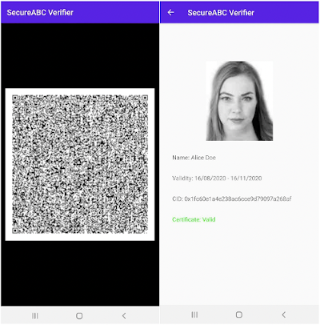

# SecureABC Paper and Reference Implementation

## Paper
The latest SecureABC AntiBody Certificates paper can be found at [SecureABC.pdf](SecureABC.pdf). The authors welcome feedback and may be contacted by email using the details in the paper or by clicking the following <a href="mailto:chicks@turing.ac.uk;dbutler@turing.ac.uk;cm@warwick.ac.uk;jon.crowcroft@cl.cam.ac.uk">link</a>.

## Reference Implementation

This repository also includes a simple reference implementation (in Python3), and proof-of-concept, of the SecureABC AntiBody Certificate proposal. In particular we currently demonstrate the feasibility of our paper-based user certificates. To generate an example paper-based credential run [Generate_QR_Credential.py](Generate_QR_Credential.py), to verify run [Verify_QR_Credential.py](Verify_QR_Credential.py). Credentials, which can be displayed as standard "version 40" QR codes, are signed using ECDSA over brainpoolP512r1 and comprise a user photo, name, a unique Certificate ID (CID) number and a validity period. Credentials are completely self-contained and can be verified offline, without interacting with the signer. Revocation is based on distributing revoked CIDs to verifiers.

Example credential:

Which comprises the following example image (145x170 Greyscale), the name "John Doe", the validity period "16052020-16082020", the CID 0x1fc60e1a4e238ac6cce9d79097a268af and a valid 512-bit ECDSA signature.

Example image:

Dependencies are as follows:
* [matplotlib](https://pypi.org/project/matplotlib/)
* [pyOpenSSL](https://pypi.org/project/pyOpenSSL/)
* [opencv-python3](https://pypi.org/project/opencv-python/)
* [qrcode 6.1](https://pypi.org/project/qrcode/)
* [zbar](http://zbar.sourceforge.net)
